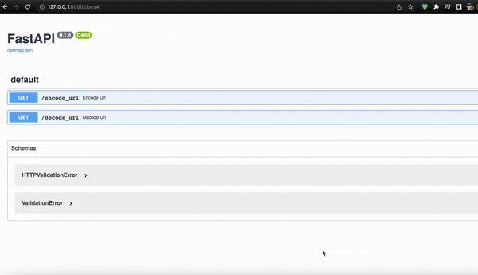

## url-shortening_service_fastapi_mongodb
The backend for the url shortening service with MongoDB instead of inmemory caching

## Installation Instructions:
   * Create a virutal environment:
     * pip install -r requirements.txt
   * Via Docker installation also possible:
     docker compose up  

## MongoDB:
   * Install MongoDB from here: https://www.mongodb.com/docs/manual/installation/ &&
     use the MongoDB atlas with a free tier cluster: https://www.mongodb.com/atlas/database?tck=docs_server

## Run:
   * uvicorn main:app --reload
   * then on  http://127.0.0.1:8000 you should see the api endpoints with Swagger UI
   * http://127.0.0.1:8000/docs# on browser.
     
## Development Philosophy:
    For small projects I avoid deploying on AWS Cloud using stuffs like AWS Elasticbean with Codepipline automation from aws.
    Plus, development clouds like Heroku and Digital Ocean charge 7 USD for just storage and running apps like Django and FastAPI
    so I hacked my way to deploying Django and FastAPI on vercel and it works.

    Also precommit hooks for code quality and consistency are used: black and isort is used. When code is pushed code gets automatically restructured for readability purposes.

    Every branch has .githubworkflow yaml which run configured pytests before branch are merged.

    pytest in itself is configured so any file with test_*.py runs. The tests are
    made such that the url encoded when decoded gives the original one.

    
## Preview
    When you run the app: put http://127.0.0.1:8000/docs# on your browser.
    

   Run the app in 1 terminal and in the other terminal:
   pytest 

